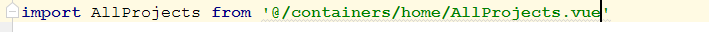
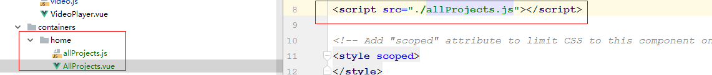
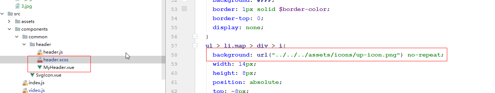

# my-blog

> 个人博客：使用vue全家桶搭建；部署地址：yahwo.cn/193.112.219.124:8080/blog

----

> iconfont: http://iconfont.cn/manage/index?manage_type=myprojects&projectId=649183

## Build Setup

``` bash
npm install  npm run dev  npm run build/npm run build --report

npm run unit (run unit tests)

npm run e2e (run e2e tests)

npm test (run all tests)
```

## TODO
> ✔ 端口号动态占用+1

> ✖ mobile 自适应

> ✖ react-native 版本

> ✖ 小程序版本

> ✔ webpack-vue（ 2018-04-29 21:02:09 ）

> ✔ 多页面配置（ 2018-04-30 22:29:07 ）

> ✔ svg icon（ 2018-05-01 17:41:53 ）

> ✔ 按需集成Element-Ui（ 2018-05-01 23:24:07 ）

> ✖ Vuex管理状态

## Remind （开发过程中遇到的坑）

> **1、命名：**

这里有一个allProjects.js 和 AllProjects.vue 文件


当 import  ' xx/AllProjects ' 时候，webpack 并没有对js、vue文件和文件名大小写区分！



> **2、路径：**

如果`<script src='allProject.js'/>` 无法找到



> **3、样式路径引用：**

样式中的url引用相对路径，是相对于@import处
（header.scss是在MyHeader.vue中@import引入的，url定位是相对于 MyHeader.vue）


